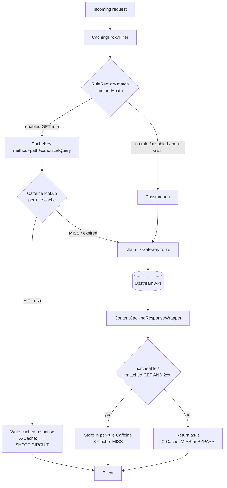

# Cache Proxy Core Design

**Spec**: `.specs/features/cache-proxy-core/spec.md`
**Status**: Draft

---

## Research Notes (verified 2026-06-24)

- Spring Boot 4.1.0 GA 2026-06-10; runs on Java 26 (baseline Java 17).
- Spring Cloud release train **2025.1.x (Oakwood)** is first compatible with Boot 4.1.0.
- Gateway module split (2025.1): WebFlux = `spring-cloud-starter-gateway-server-webflux`; WebMVC = `spring-cloud-starter-gateway-server-webmvc` (MVC server available from 4.1.x onward).
- `org.springframework.web.util.ContentCachingResponseWrapper` (spring-web) buffers response body — usable for MISS capture in the servlet model.
- Virtual threads via `spring.threads.virtual.enabled=true` (Boot 3.2+, present in 4.1).
- ⚠️ **To validate in Execute:** exact ordering of a servlet `Filter` relative to Gateway Server WebMVC `RouterFunction` handling (HIT short-circuit must run before routing). Design assumes a high-precedence `OncePerRequestFilter` runs before the gateway handler — confirm on first run.

---

## Architecture Overview

p5k-proxy-cache is the Gateway app. A single catch-all route forwards everything to one configured upstream. Caching is layered **in front of routing** as a servlet filter: on HIT it short-circuits (never reaches the gateway handler → never calls upstream); on MISS it lets the request route, buffers the upstream response, and stores it.



---

## Code Reuse Analysis

Greenfield — no internal code yet. Leverage framework + this project's sibling features.

### Existing Components to Leverage

| Component | Location | How to Use |
| --- | --- | --- |
| `ContentCachingResponseWrapper` | spring-web | Buffer upstream response body on MISS for storage |
| `OncePerRequestFilter` | spring-web | Base for `CachingProxyFilter` |
| Spring Cloud Gateway Server WebMVC | `spring-cloud-starter-gateway-server-webmvc` | Single catch-all route → upstream; timeouts/retries |
| Caffeine | `com.github.ben-manes.caffeine` | Per-rule in-memory cache with TTL + maxSize |
| Micrometer / Actuator | Boot starter | Hit/miss/bypass counters (Observability feature) |

### Integration Points

| System | Integration Method |
| --- | --- |
| Rule Store feature | `RuleRegistry` reads `cache_rule` rows (Postgres via JPA) into an in-memory snapshot; refreshed on rule mutation |
| Upstream API | Single base URL from app config; Gateway route forwards |
| Observability feature | `CachingProxyFilter` increments Micrometer counters |

---

## Components

### CachingProxyFilter
- **Purpose**: Orchestrate cache lookup, HIT short-circuit, MISS capture/store, and passthrough; set `X-Cache`.
- **Location**: `proxy/CachingProxyFilter.java`
- **Interfaces**:
  - `doFilterInternal(HttpServletRequest, HttpServletResponse, FilterChain): void`
- **Dependencies**: `RuleRegistry`, `CaffeineCacheRegistry`, `CacheKeyFactory`, `CacheMetrics`
- **Reuses**: `OncePerRequestFilter`, `ContentCachingResponseWrapper`
- **Covers**: CACHE-01,02,04,05,06,08,09,10

### RuleRegistry
- **Purpose**: Hold in-memory snapshot of enabled rules and match a request to the most-specific rule.
- **Location**: `rules/RuleRegistry.java`
- **Interfaces**:
  - `match(String method, String path): Optional<CacheRule>` — longest/most-specific match, enabled + method=GET only
  - `reload(): void` — rebuild snapshot from store (called by Rule Store on mutation)
- **Dependencies**: Rule Store repository
- **Reuses**: `AntPathMatcher` (Spring) for `path_pattern`
- **Covers**: CACHE-10, CACHE-12

### CacheKeyFactory
- **Purpose**: Build canonical cache key.
- **Location**: `cache/CacheKeyFactory.java`
- **Interfaces**:
  - `keyOf(HttpServletRequest): String` → `GET /path?sortedCanonicalQuery`
- **Dependencies**: none
- **Covers**: CACHE-11 (sort query params), edge: ignore body/headers

### CaffeineCacheRegistry
- **Purpose**: Own one Caffeine cache per rule, each built with that rule's TTL + maxSize; rebuild on rule change.
- **Location**: `cache/CaffeineCacheRegistry.java`
- **Interfaces**:
  - `cacheFor(CacheRule): Cache<String, CachedResponse>`
  - `evictRule(ruleId): void` / `rebuild(CacheRule): void`
- **Dependencies**: Caffeine
- **Covers**: CACHE-03 (TTL expiry), edge: maxSize eviction

### CachedResponse (value)
- **Purpose**: Immutable snapshot of a cacheable response.
- **Location**: `cache/CachedResponse.java`
- **Fields**: `int status`, `String contentType`, `Map<String,String> safeHeaders`, `byte[] body`
- **Covers**: CACHE-13 (only safe/allowlisted headers stored; hop-by-hop stripped)

### Upstream Route Config
- **Purpose**: Single catch-all Gateway route → configured upstream, with connect/read timeout.
- **Location**: `config/GatewayConfig.java` (+ `application.yml`)
- **Interfaces**: `RouterFunction<ServerResponse>` route all → `${proxy.upstream.base-url}`
- **Covers**: CACHE-07 (timeout → 504; connection refused → 502, no cache)

---

## Data Models

In-memory only (the `cache_rule` table is owned by the Rule Store feature; shown here for reference).

```java
// Reference — owned by Rule Store
record CacheRule(
    Long id,
    String pathPattern,   // Ant pattern, e.g. /api/products/**
    Set<String> methods,  // v1: {"GET"}
    long ttlSeconds,
    long maxSize,
    boolean enabled
) {}

// Owned by this feature — stored in Caffeine
record CachedResponse(
    int status,
    String contentType,
    Map<String,String> safeHeaders,
    byte[] body
) {}
```

**Cache structure:** `ruleId -> Caffeine<cacheKey, CachedResponse>`, each cache built `expireAfterWrite(ttlSeconds)` + `maximumSize(maxSize)`.

---

## Error Handling Strategy

| Error Scenario | Handling | Client Impact |
| --- | --- | --- |
| Upstream read timeout | Gateway returns 504; filter skips store | 504, `X-Cache: MISS` |
| Upstream connection refused | Gateway returns 502; filter skips store | 502, `X-Cache: MISS` |
| Upstream non-2xx (4xx/5xx) | Returned as-is; not cached (CACHE-05) | Original status, no cache write |
| Cache write/read throws | Log + degrade to passthrough; never fail the request | Correct response, `X-Cache: MISS` |
| Rules not yet loaded / empty | Everything passthrough | `X-Cache: BYPASS` |
| Concurrent MISS same key | May double-fetch (single-flight out of scope, M3); last write wins | Correct, possibly >1 upstream call |

---

## Tech Decisions (non-obvious)

| Decision | Choice | Rationale |
| --- | --- | --- |
| **Gateway flavor** ⭐ confirm | **Server WebMVC + virtual threads** (`spring.threads.virtual.enabled=true`) | Servlet model makes response-body capture/replay simple (`ContentCachingResponseWrapper`, `byte[]`). Java 26 virtual threads remove the blocking-thread cost that normally favors WebFlux. Alternative = WebFlux (reactive `DataBuffer` decoration is more complex). Reverse if team standardizes on reactive. |
| Caching layer placement | Servlet `OncePerRequestFilter` in front of routing | HIT short-circuits before the gateway handler → upstream never called. Cleanly separates caching from forwarding. |
| Per-rule TTL/size | One Caffeine cache per rule in a registry | Native per-rule `expireAfterWrite` + `maximumSize`; rebuild on rule change. Simpler than a single cache with custom `Expiry`. |
| Header handling | Store allowlist only; strip hop-by-hop | Avoids replaying `Connection`/`Transfer-Encoding`/`Content-Length` mismatches from cache (CACHE-13) |
| Cacheable predicate | matched enabled GET rule AND upstream 2xx | Matches spec; errors and non-GET never poison cache |

---

## Requirement Coverage

| Req | Component | Req | Component |
| --- | --- | --- | --- |
| CACHE-01 HIT serve | CachingProxyFilter | CACHE-08 unmatched passthrough | CachingProxyFilter |
| CACHE-02 X-Cache:HIT | CachingProxyFilter | CACHE-09 non-GET passthrough | RuleRegistry/Filter |
| CACHE-03 TTL expiry | CaffeineCacheRegistry | CACHE-10 disabled passthrough | RuleRegistry |
| CACHE-04 MISS store 2xx | CachingProxyFilter | CACHE-11 canonical key | CacheKeyFactory |
| CACHE-05 non-2xx no cache | CachingProxyFilter | CACHE-12 most-specific match | RuleRegistry |
| CACHE-06 X-Cache:MISS | CachingProxyFilter | CACHE-13 strip hop-by-hop | CachedResponse |
| CACHE-07 upstream down 5xx | GatewayConfig | | |

All 13 requirements mapped.
