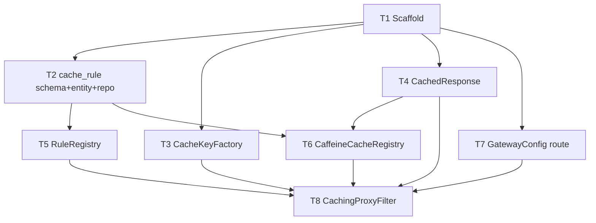

# Cache Proxy Core Tasks

**Design**: `.specs/features/cache-proxy-core/design.md`
**Testing**: `.specs/codebase/TESTING.md`
**Status**: ✅ Done — all 8 tasks verified. `mvn verify`: 14 unit + 11 IT = 25 tests green.

Scope note: this vertical slice includes the minimum **Scaffold** (T1) and **Rule Store** (T2 schema/entity/repo) needed to demo the cache core. Full admin CRUD (Rule Store) and metrics dashboards (Observability) are separate features with their own task files.

Gate commands (from TESTING.md): quick = `./mvnw -q test` · full = `./mvnw -q verify` · build = `./mvnw -q -DskipTests package`.

---

## Execution Plan

```
Phase 1 (Foundation):      T1

Phase 2 (after T1):        T3 [P] ─┐
                           T4 [P] ─┤   units, parallel
                           T2      │   integration, sequential
                           T7      │   integration, sequential

Phase 3 (after T2,T4):     T5 [P]      RuleRegistry  (dep T2)
                           T6 [P]      CaffeineCacheRegistry (dep T2,T4)

Phase 4 (Integration):     T8          CachingProxyFilter (dep T3,T4,T5,T6,T7)
```



---

## Task Breakdown

### T1: Scaffold Maven project + app bootstrap

**What**: Maven project for Spring Boot 4.1 (Java 26) with Spring Cloud Gateway Server WebMVC, Caffeine, Data JPA, Postgres driver, Flyway, Actuator; main app class; `application.yml` with virtual threads + upstream base-url placeholder. Test deps: Testcontainers (postgresql, junit-jupiter), MockWebServer.
**Where**: `pom.xml`, `src/main/java/.../PkOpenCacheApplication.java`, `src/main/resources/application.yml`
**Depends on**: None
**Reuses**: Spring Initializr layout, `java-springboot` skill best practices
**Requirement**: foundation (enables all)

**Tools**: MCP: NONE · Skill: `java-springboot`

**Done when**:
- [ ] `pom.xml` pins Spring Cloud BOM `2025.1.x` (Oakwood) + Boot 4.1.0; Java 26 compiler
- [ ] `spring.threads.virtual.enabled=true`; `proxy.upstream.base-url` config key present
- [ ] App context loads against a Testcontainers Postgres
- [ ] Gate passes: `./mvnw -q verify`
- [ ] Test count: ≥1 integration test passes (context load)

**Tests**: integration · **Gate**: full
**Verify**: `./mvnw -q verify` green; app starts via `./mvnw spring-boot:run` (needs local Postgres)
**Commit**: `chore(scaffold): bootstrap Spring Boot 4.1 gateway project`
**Result (2026-06-24)**: ✅ DONE. `mvn verify` green — context-load IT passed (1 test) against real Postgres; deps resolve, wrapper generated. Pinned: Boot 4.1.0, spring-cloud 2025.1.2, Testcontainers 2.0.5 (Boot-managed).

---

### T2: cache_rule schema + entity + repository

**What**: Flyway `V1__cache_rule.sql` + `CacheRule` JPA entity (id, path_pattern, methods, ttl_seconds, max_size, enabled) + `CacheRuleRepository`.
**Where**: `src/main/resources/db/migration/V1__cache_rule.sql`, `rules/CacheRule.java`, `rules/CacheRuleRepository.java`
**Depends on**: T1
**Reuses**: Spring Data JPA `JpaRepository`
**Requirement**: CACHE-03 (ttl), CACHE-10 (enabled), maxSize

**Tools**: MCP: NONE · Skill: `java-springboot`

**Done when**:
- [ ] Migration applies cleanly; entity maps all columns; `methods` persisted (e.g. CSV/array)
- [ ] Repo `save`/`findAllByEnabledTrue` works against Testcontainers Postgres
- [ ] Gate passes: `./mvnw -q verify`
- [ ] Test count: ≥2 integration tests pass (persist + query enabled)

**Tests**: integration · **Gate**: full
**Verify**: IT inserts a rule, reads it back enabled-only
**Commit**: `feat(rules): add cache_rule schema, entity, repository`
**Result (2026-06-24)**: ✅ DONE. `mvn verify` green — 3 ITs pass; Flyway applies V1. Needed `spring-boot-flyway` autoconfig module (see L-003). methods stored CSV via `StringSetConverter`.

---

### T3: CacheKeyFactory [P]

**What**: Build canonical cache key `METHOD /path?sortedQuery` from request; query params sorted; body/headers ignored.
**Where**: `cache/CacheKeyFactory.java`
**Depends on**: T1
**Reuses**: `org.springframework.web.util.UriComponentsBuilder`
**Requirement**: CACHE-11

**Tools**: MCP: NONE · Skill: NONE

**Done when**:
- [ ] `?a=1&b=2` and `?b=2&a=1` produce identical keys
- [ ] Method + path included; same path different query → different keys
- [ ] Gate passes: `./mvnw -q test`
- [ ] Test count: ≥3 unit tests pass

**Tests**: unit · **Gate**: quick
**Verify**: unit asserts key equality on reordered query
**Commit**: `feat(cache): canonical cache key factory`
**Result (2026-06-24)**: ✅ DONE. `mvn test` green — 3 unit tests (method+path, sorted query equality, distinct values).

---

### T4: CachedResponse value [P]

**What**: Immutable `CachedResponse` (status, contentType, safeHeaders, body[]) + header allowlist that strips hop-by-hop headers when capturing.
**Where**: `cache/CachedResponse.java`
**Depends on**: T1
**Reuses**: record type
**Requirement**: CACHE-13

**Tools**: MCP: NONE · Skill: NONE

**Done when**:
- [ ] Factory from response strips `Connection`, `Transfer-Encoding`, `Content-Length`, `Keep-Alive`
- [ ] Retains `Content-Type` and allowlisted headers
- [ ] Gate passes: `./mvnw -q test`
- [ ] Test count: ≥2 unit tests pass

**Tests**: unit · **Gate**: quick
**Verify**: unit asserts hop-by-hop stripped, content-type kept
**Commit**: `feat(cache): cached response value with header allowlist`
**Result (2026-06-24)**: ✅ DONE. `mvn test` green — 3 unit tests (strip hop-by-hop, retain status/ct/body, case-insensitive). 6 unit total.

---

### T5: RuleRegistry [P]

**What**: In-memory snapshot of enabled rules; `match(method, path)` returns most-specific (longest pattern) enabled GET rule; `reload()` rebuilds from repo.
**Where**: `rules/RuleRegistry.java`
**Depends on**: T2
**Reuses**: `org.springframework.util.AntPathMatcher`, `CacheRuleRepository`
**Requirement**: CACHE-09, CACHE-10, CACHE-12

**Tools**: MCP: NONE · Skill: NONE

**Done when**:
- [ ] Non-GET → no match; disabled rule → no match
- [ ] Two matching patterns → longest/most-specific wins deterministically
- [ ] `reload()` swaps snapshot atomically
- [ ] Gate passes: `./mvnw -q test`
- [ ] Test count: ≥4 unit tests pass

**Tests**: unit · **Gate**: quick
**Verify**: unit with overlapping patterns asserts specificity + GET/enabled filtering
**Commit**: `feat(rules): in-memory rule registry with most-specific matcher`

---

### T6: CaffeineCacheRegistry [P]

**What**: One Caffeine cache per rule built `expireAfterWrite(ttlSeconds)` + `maximumSize(maxSize)`; `cacheFor(rule)`, `rebuild(rule)`, `evictRule(id)`.
**Where**: `cache/CaffeineCacheRegistry.java`
**Depends on**: T2, T4
**Reuses**: Caffeine `Cache`, `CacheRule`, `CachedResponse`
**Requirement**: CACHE-03, maxSize eviction

**Tools**: MCP: NONE · Skill: NONE

**Done when**:
- [ ] Entry expires after TTL (use fake ticker); evicts past maxSize without error
- [ ] `rebuild` replaces a rule's cache; `evictRule` clears it
- [ ] Gate passes: `./mvnw -q test`
- [ ] Test count: ≥3 unit tests pass

**Tests**: unit · **Gate**: quick
**Verify**: unit with Caffeine fake ticker asserts expiry + size eviction
**Commit**: `feat(cache): per-rule caffeine cache registry`
**Result (2026-06-24)**: ✅ DONE. 4 unit tests (same-instance, TTL expiry via fake ticker, maxSize eviction, rebuild). Added `clearAll()` + all-args `CacheRule` ctor for keying by id.

---

### T7: GatewayConfig single-upstream route

**What**: Catch-all Gateway Server WebMVC route forwarding all paths to `proxy.upstream.base-url` with connect/read timeouts (timeout→504, refused→502).
**Where**: `config/GatewayConfig.java`, `application.yml`
**Depends on**: T1
**Reuses**: Spring Cloud Gateway WebMVC `RouterFunction`/route DSL
**Requirement**: CACHE-07

**Tools**: MCP: NONE · Skill: `java-springboot`

**Done when**:
- [ ] GET to any path forwards to MockWebServer upstream, response returned verbatim
- [ ] Read timeout → 504; connection refused → 502
- [ ] Gate passes: `./mvnw -q verify`
- [ ] Test count: ≥2 integration tests pass (forward + timeout)

**Tests**: integration · **Gate**: full
**Verify**: IT points upstream at StubUpstream, asserts forward + down→5xx
**Commit**: `feat(proxy): single-upstream gateway route with timeouts`
**Result (2026-06-24)**: ✅ DONE. 2 ITs (forward verbatim, upstream-down→5xx). DSL: `route(id).route(path("/**"), http()).before(uri(base))`. SPEC_DEVIATION: assert generic 5xx (not exact 502 vs 504) — gateway exposes no per-code timeout config; CACHE-07 ("down→5xx, no cache") still met.

---

### T8: CachingProxyFilter (orchestration)

**What**: `OncePerRequestFilter` (high precedence): match rule → build key → Caffeine lookup. HIT → write cached response + `X-Cache: HIT`, short-circuit (no upstream). MISS → wrap with `ContentCachingResponseWrapper`, route, store only 2xx, `X-Cache: MISS`. Unmatched/non-GET/disabled → passthrough `X-Cache: BYPASS`. Cache errors degrade to passthrough.
**Where**: `proxy/CachingProxyFilter.java`
**Depends on**: T3, T4, T5, T6, T7
**Reuses**: `OncePerRequestFilter`, `ContentCachingResponseWrapper`, registries from T5/T6
**Requirement**: CACHE-01, CACHE-02, CACHE-04, CACHE-05, CACHE-06, CACHE-08 (exercises 09-13 end-to-end)

**Tools**: MCP: NONE · Skill: `java-springboot`

**Done when**:
- [ ] HIT served from cache, `X-Cache: HIT`, MockWebServer request count stays 0 on 2nd call
- [ ] MISS forwards once, caches 2xx; non-2xx returned but not cached
- [ ] Unmatched + non-GET + disabled → `X-Cache: BYPASS`, never cached
- [ ] Cache lookup/store throwing → request still succeeds (passthrough)
- [ ] Validates servlet Filter runs before Gateway route (design open item)
- [ ] Gate passes: `./mvnw -q verify`
- [ ] Test count: ≥6 integration tests pass (HIT, MISS, non-2xx, bypass-unmatched, non-GET, error-degrade)

**Tests**: integration · **Gate**: full
**Verify**: full IT flow with seeded rule + StubUpstream asserting `X-Cache` + upstream counts
**Commit**: `feat(proxy): caching filter with HIT short-circuit and MISS capture`
**Result (2026-06-24)**: ✅ DONE. 6 ITs: miss→hit (0 extra upstream calls), non-2xx not cached, unmatched BYPASS, non-GET BYPASS, disabled BYPASS, reordered-query HIT. Registered via `FilterRegistrationBean` at HIGHEST_PRECEDENCE; HIT short-circuit confirmed (filter runs before gateway route). `ContentCachingResponseWrapper` captures proxied body correctly.

---

## Pre-Approval Validation

### Check 1 — Granularity

| Task | Scope | Status |
| --- | --- | --- |
| T1 | project scaffold (cohesive bootstrap) | ✅ |
| T2 | 1 migration + 1 entity + 1 repo (cohesive data layer) | ✅ |
| T3 | 1 class | ✅ |
| T4 | 1 value class | ✅ |
| T5 | 1 class | ✅ |
| T6 | 1 class | ✅ |
| T7 | 1 config (route) | ✅ |
| T8 | 1 filter component | ✅ |

### Check 2 — Diagram ↔ Definition Cross-Check

| Task | Depends on (body) | Diagram arrows in | Status |
| --- | --- | --- | --- |
| T1 | None | — | ✅ |
| T2 | T1 | T1→T2 | ✅ |
| T3 | T1 | T1→T3 | ✅ |
| T4 | T1 | T1→T4 | ✅ |
| T5 | T2 | T2→T5 | ✅ |
| T6 | T2, T4 | T2→T6, T4→T6 | ✅ |
| T7 | T1 | T1→T7 | ✅ |
| T8 | T3, T4, T5, T6, T7 | T3,T4,T5,T6,T7→T8 | ✅ |

`[P]` tasks share no inter-dependency within their phase (T3/T4 independent; T5/T6 independent). ✅

### Check 3 — Test Co-location Validation

| Task | Layer | Matrix requires | Task says | Status |
| --- | --- | --- | --- | --- |
| T1 | app bootstrap | integration | integration | ✅ |
| T2 | JPA+Flyway | integration | integration | ✅ |
| T3 | value/util | unit | unit | ✅ |
| T4 | value/util | unit | unit | ✅ |
| T5 | domain logic | unit | unit | ✅ |
| T6 | domain logic | unit | unit | ✅ |
| T7 | gateway route | integration | integration | ✅ |
| T8 | proxy filter | integration | integration | ✅ |

All checks pass. No deferred tests; every task verifies its own code.

---

## Requirement → Task Coverage

| Req | Task | Req | Task |
| --- | --- | --- | --- |
| CACHE-01 | T8 | CACHE-08 | T8 |
| CACHE-02 | T8 | CACHE-09 | T5 (+T8) |
| CACHE-03 | T6 | CACHE-10 | T5 |
| CACHE-04 | T8 | CACHE-11 | T3 |
| CACHE-05 | T8 | CACHE-12 | T5 |
| CACHE-06 | T8 | CACHE-13 | T4 |
| CACHE-07 | T7 | | |

13/13 mapped.
